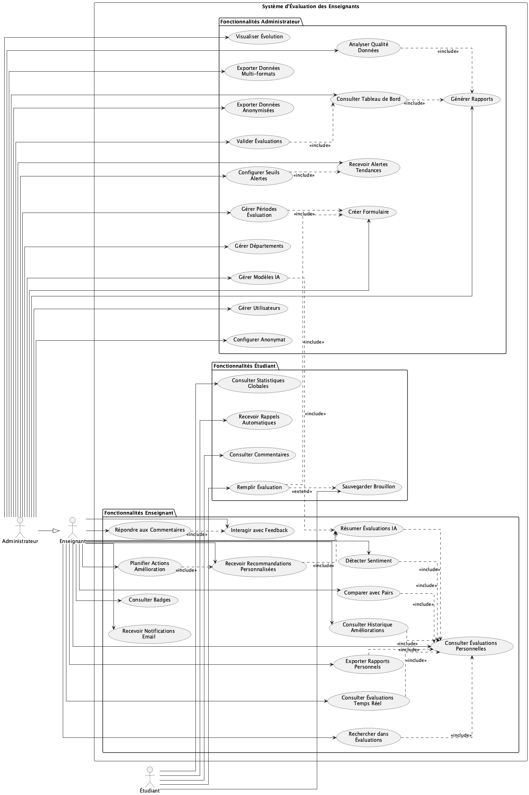
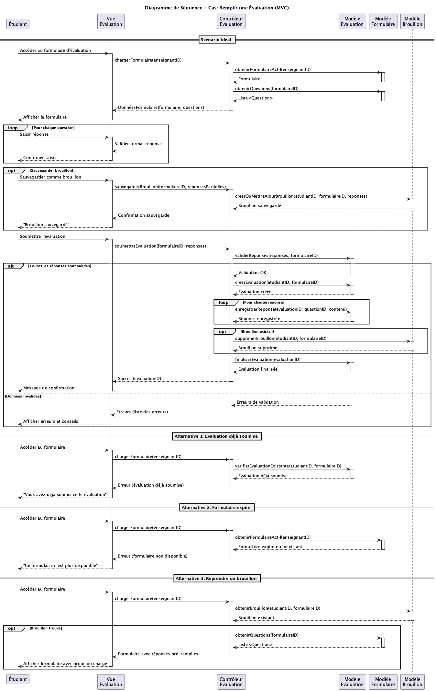
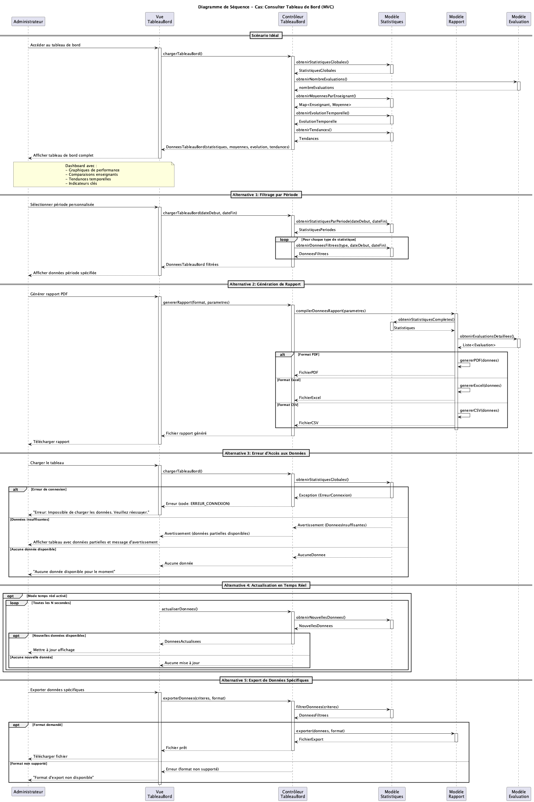
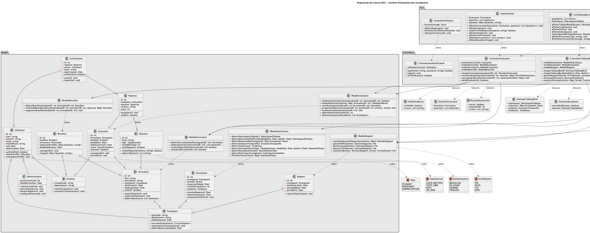
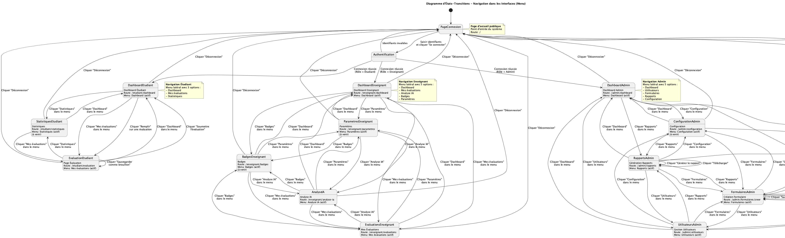
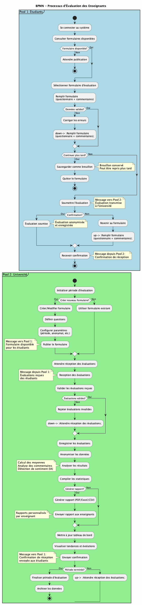
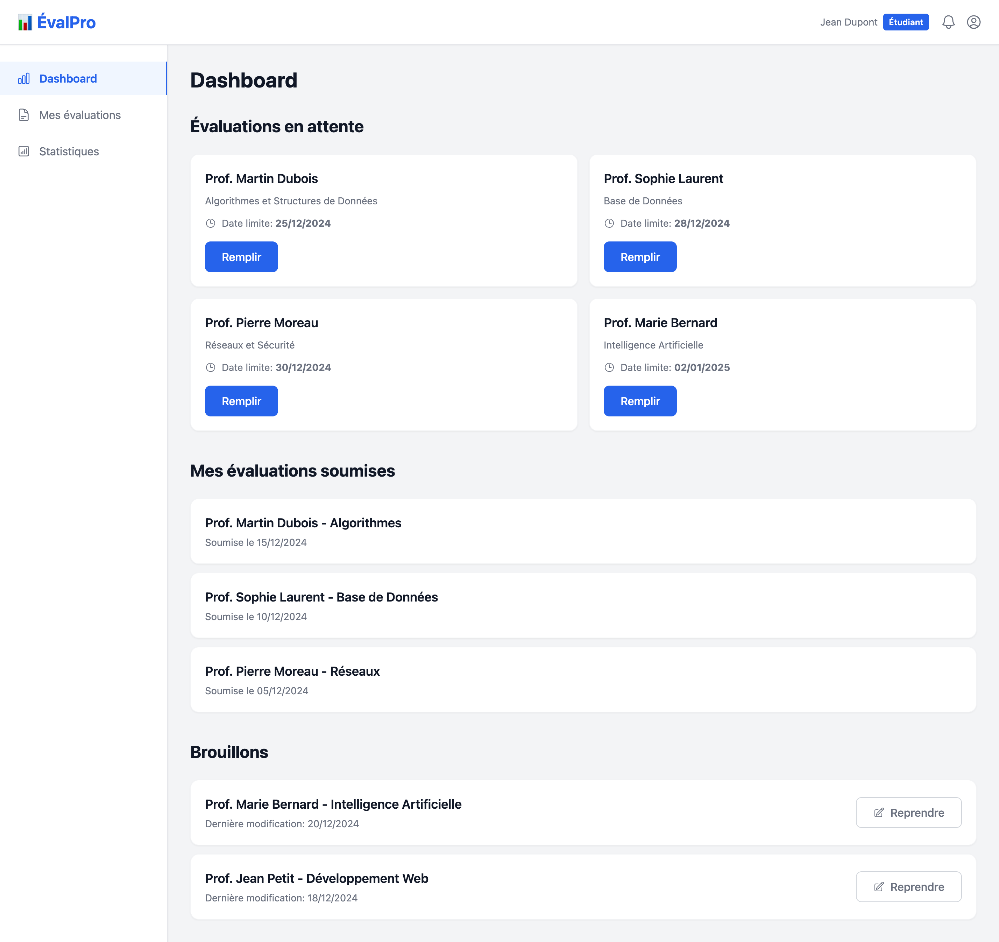
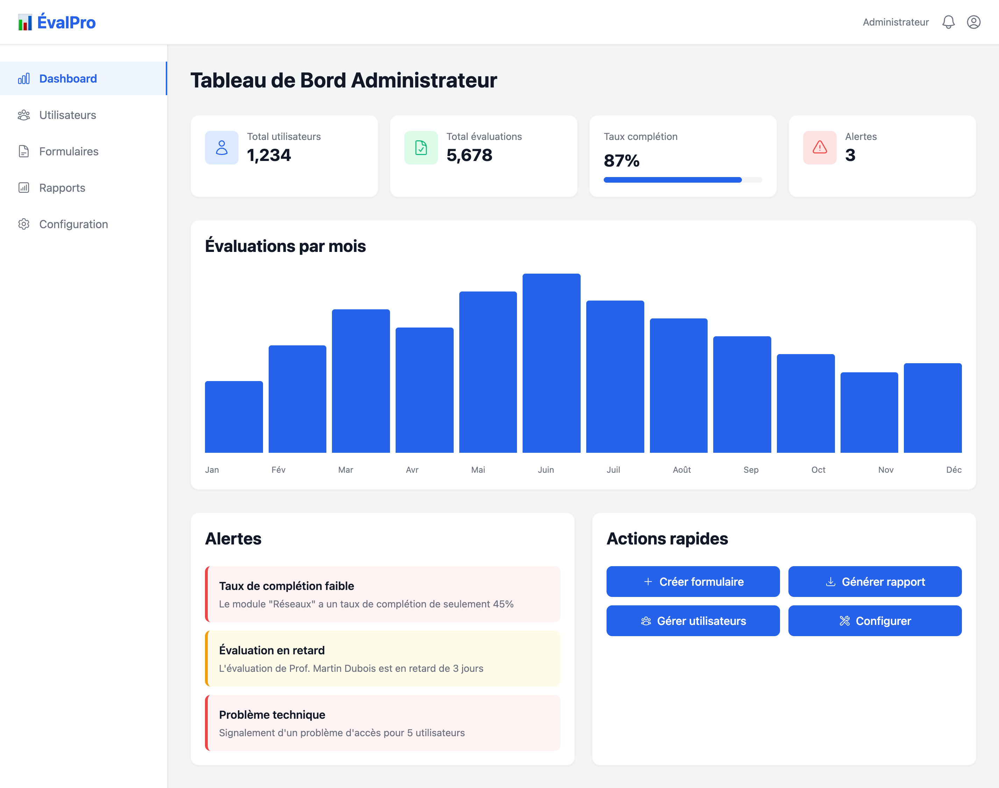
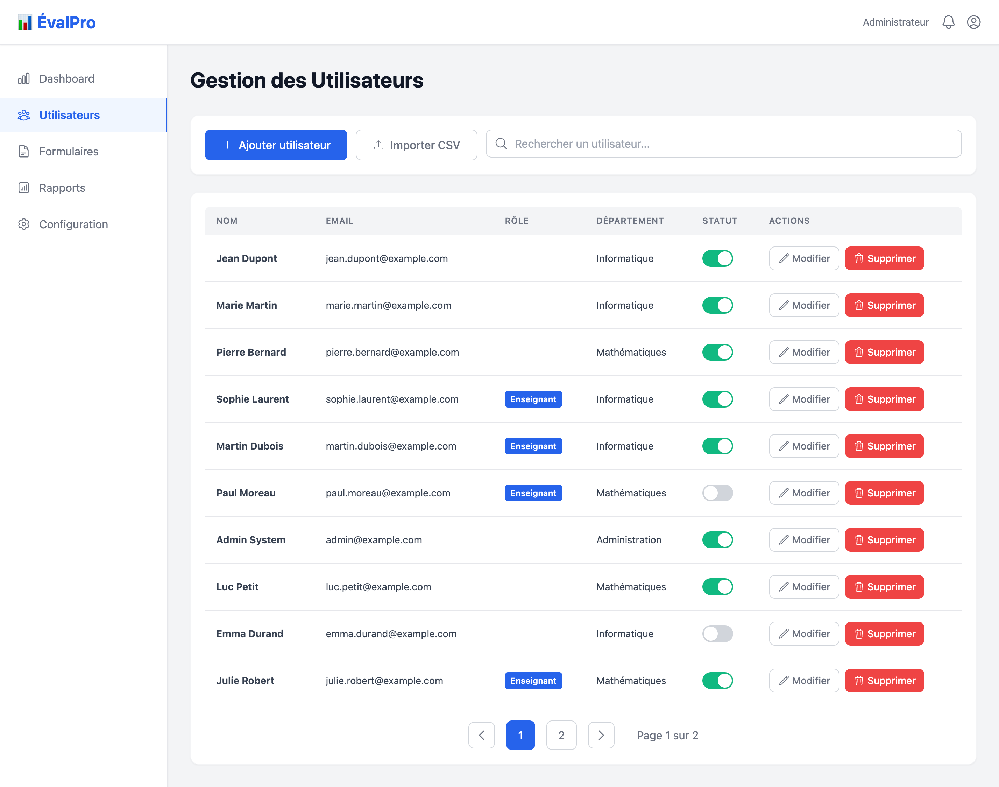

# Rapport Complet du Projet MVC
## Système d'Évaluation des Enseignants

**Date :** Décembre 2024  
**Binome :** Adil Chetouni & Mehédi Touré

---

## Introduction

Ce rapport présente de manière exhaustive toutes les étapes de modélisation d'un système d'évaluation des enseignants suivant l'architecture **MVC (Modèle-Vue-Contrôleur)**. Le système permet aux étudiants d'évaluer leurs enseignants, aux enseignants de consulter leurs évaluations avec des analyses avancées utilisant l'intelligence artificielle, et aux administrateurs de gérer le système et générer des rapports détaillés.

Le projet a été mené en suivant une approche méthodique, en commençant par l'identification des besoins fonctionnels, puis en modélisant l'architecture, les interactions, et enfin en créant des prototypes d'interface utilisateur. Chaque étape a été documentée avec des diagrammes UML et BPMN, garantissant une compréhension complète du système.

L'objectif de ce rapport est de présenter tous les diagrammes générés au cours du projet, incluant les analyses effectuées et les décisions architecturales prises. Ce document présente les différentes étapes de modélisation, les diagrammes PNG correspondants, et les captures d'écran des interfaces.

---

## Objectifs du Projet

### Objectifs Principaux

- Modéliser le système avec UML et BPMN pour garantir une compréhension complète des processus métier
- Définir une architecture MVC claire et documentée
- Créer des prototypes d'interface pour tous les types d'utilisateurs (Étudiant, Enseignant, Administrateur)
- Documenter tous les processus métier et les interactions entre les composants
- Générer des diagrammes PNG pour visualisation et présentation

---

## Étapes Détaillées du Projet

### Étape 1 : Cas d'Utilisation

**Description :** Identification et modélisation de tous les cas d'utilisation du système

#### Objectif

Identifier et documenter tous les cas d'utilisation du système d'évaluation des enseignants en définissant les interactions entre les acteurs et le système. Cette étape permet de comprendre les besoins fonctionnels complets et de définir le périmètre du projet.

#### Méthodologie

- Identification des trois acteurs principaux : Étudiant, Enseignant, Administrateur
- Analyse des besoins fonctionnels pour chaque acteur
- Définition de 34 cas d'utilisation détaillés
- Modélisation des relations d'inclusion et d'extension
- Documentation des préconditions et postconditions

#### Résultats

- 34 cas d'utilisation identifiés et documentés
- 5 cas pour les Étudiants (remplir évaluation, consulter commentaires, recevoir rappels, sauvegarder brouillon, consulter statistiques)
- 14 cas pour les Enseignants (consulter évaluations, analyse IA, détection sentiment, recommandations, comparaison avec pairs, badges, historique, etc.)
- 15 cas pour les Administrateurs (gestion utilisateurs, création formulaires, génération rapports, configuration anonymat, analyse qualité, gestion modèles IA, etc.)
- Relations d'héritage : Administrateur hérite de tous les droits d'Enseignant
- Relations d'inclusion et d'extension documentées

#### Analyse

L'analyse des cas d'utilisation révèle un système riche en fonctionnalités, avec une attention particulière portée aux fonctionnalités avancées utilisant l'intelligence artificielle. Les enseignants bénéficient d'outils d'analyse sophistiqués (résumé IA, détection de sentiment, recommandations personnalisées) qui les aident à améliorer leur pratique pédagogique. Le système respecte également les principes de confidentialité avec des options d'anonymat configurables.

#### Conclusion

Cette étape a permis de définir clairement le périmètre fonctionnel du système. Les 34 cas d'utilisation couvrent tous les besoins identifiés et servent de base pour les étapes suivantes de modélisation.

#### Diagramme

---

### Étape 2 : Diagramme de Séquence - Remplir Évaluation

**Description :** Modélisation du processus de remplissage d'évaluation selon l'architecture MVC

#### Objectif

Modéliser en détail le processus de remplissage d'une évaluation par un étudiant en suivant l'architecture MVC. Le diagramme de séquence permet de visualiser les interactions entre les différents composants du système et de comprendre le flux de données et de contrôle.

#### Méthodologie

- Décomposition selon l'architecture MVC (Modèle-Vue-Contrôleur)
- Identification des participants : Étudiant, Vue Evaluation, Contrôleur Evaluation, Modèle Evaluation, Modèle Formulaire, Modèle Brouillon
- Modélisation du scénario principal (scénario idéal)
- Définition des scénarios alternatifs (évaluation déjà soumise, formulaire expiré, reprise de brouillon)
- Utilisation des opérateurs UML (loop, opt, alt) pour clarifier les flux

#### Résultats

- Scénario principal documenté : chargement du formulaire, saisie des réponses, sauvegarde optionnelle du brouillon, validation et soumission
- Gestion complète des brouillons permettant aux étudiants de reprendre leur travail plus tard
- Validation robuste des données avec messages d'erreur explicites
- Alternatives gérées : évaluation déjà soumise, formulaire expiré, reprise de brouillon existant
- Architecture MVC respectée : séparation claire entre Vue (affichage), Contrôleur (orchestration), et Modèle (logique métier et données)
- Aucune requête SQL directe : toutes les opérations passent par les méthodes du modèle

#### Analyse

Le diagramme montre une architecture bien structurée où chaque composant a des responsabilités claires. La gestion des brouillons améliore l'expérience utilisateur en permettant aux étudiants de sauvegarder leur travail progressivement. La validation des données est effectuée à plusieurs niveaux (côté vue pour le format, côté modèle pour la logique métier), garantissant la qualité des données soumises. L'absence de SQL direct dans les diagrammes garantit une abstraction de la couche de persistance, facilitant la maintenance et les tests.

#### Conclusion

Ce diagramme de séquence fournit une référence précise pour la modélisation du processus de remplissage d'évaluation. Il documente tous les scénarios possibles et garantit que l'architecture MVC est bien définie.

#### Diagramme

---

### Étape 3 : Diagramme de Séquence - Tableau de Bord

**Description :** Modélisation du processus de consultation du tableau de bord administrateur

#### Objectif

Modéliser le processus de consultation et de gestion du tableau de bord administrateur, incluant le chargement des statistiques, la génération de rapports, et la gestion des erreurs. Ce diagramme illustre la complexité de l'orchestration des données pour fournir une vue d'ensemble complète du système.

#### Méthodologie

- Identification des participants : Administrateur, Vue TableauBord, Contrôleur TableauBord, Modèle Statistiques, Modèle Rapport, Modèle Evaluation
- Modélisation du scénario principal de chargement du tableau de bord
- Définition de 5 scénarios alternatifs : filtrage par période, génération de rapport, gestion des erreurs, actualisation temps réel, export de données
- Gestion complète des cas d'erreur (connexion, données insuffisantes, aucune donnée)
- Modélisation de l'actualisation en temps réel optionnelle

#### Résultats

- Scénario principal documenté : chargement des statistiques globales, calcul des moyennes par enseignant, analyse de l'évolution temporelle, identification des tendances
- Support de multiples formats d'export : PDF, Excel, CSV
- Gestion robuste des erreurs avec messages appropriés pour chaque situation
- Mode temps réel optionnel permettant une actualisation automatique des données
- Filtrage avancé par période et critères personnalisés
- Génération de rapports complets avec compilation de toutes les données nécessaires

#### Analyse

Le tableau de bord administrateur est un composant central du système, nécessitant l'agrégation de données provenant de multiples sources. Le diagramme montre une architecture modulaire où chaque modèle gère un aspect spécifique (statistiques, évaluations, rapports), permettant une maintenance et une évolution facilitées. La gestion des erreurs est particulièrement soignée, avec des messages différenciés selon le type de problème rencontré.

#### Conclusion

Ce diagramme de séquence documente un processus complexe mais bien structuré. Il garantit que le tableau de bord pourra fournir des informations complètes et à jour aux administrateurs, tout en gérant efficacement les cas d'erreur et les besoins d'export.

#### Diagramme

---

### Étape 4 : Diagramme de Classes MVC

**Description :** Modélisation de la structure des classes selon l'architecture MVC

#### Objectif

Définir la structure complète du système en classes selon l'architecture MVC. Le diagramme de classes modélise la structure statique du système, définissant les classes, leurs attributs, leurs méthodes, et les relations entre elles.

#### Méthodologie

- Organisation en trois packages principaux : Model, Contrôleur, Vue
- Définition des classes métier (Utilisateur, Etudiant, Enseignant, Administrateur, Evaluation, Formulaire, Question, Reponse, Brouillon, etc.)
- Création des classes d'accès aux données (ModeleEvaluation, ModeleFormulaire, ModeleBrouillon, ModeleStatistiques, ModeleRapport)
- Définition des contrôleurs (ControleurEvaluation, ControleurTableauBord, ControleurFormulaire, etc.)
- Spécification des vues (VueEvaluation, VueTableauBord, VueGestionFormulaires, etc.)
- Modélisation des relations (héritage, association, composition, dépendance)
- Définition des types de données et énumérations (StatutEvaluation, TypeQuestion, FormatExport, Role)

#### Résultats

- Architecture MVC complète avec séparation claire des responsabilités
- 11 classes métier définies avec leurs attributs et méthodes
- 5 classes de modèles d'accès aux données encapsulant la logique de persistance
- 6 contrôleurs orchestrant les interactions entre vues et modèles
- 7 vues gérant l'affichage et l'interaction utilisateur
- Relations d'héritage : Etudiant, Enseignant, Administrateur héritent de Utilisateur
- Relations d'association et de composition documentées entre toutes les classes
- Types de données et énumérations définis pour garantir la cohérence

#### Analyse

Le diagramme de classes révèle une architecture bien pensée avec une séparation claire des responsabilités. Les classes de modèle encapsulent tous les accès aux données, permettant une abstraction complète de la couche de persistance. Cette approche facilite les tests (possibilité de mocker les modèles), la maintenance (changement de SGBD sans impact sur les autres couches), et l'évolutivité. Les contrôleurs orchestrent les opérations sans contenir de logique métier, et les vues se concentrent uniquement sur l'affichage. Cette architecture respecte les principes SOLID et facilite la réutilisabilité des composants.

#### Conclusion

Le diagramme de classes fournit une référence complète pour la modélisation du système. Il garantit que l'architecture MVC est bien définie et que tous les composants nécessaires sont identifiés. La structure modulaire permet une évolution future du système sans impact majeur sur les composants existants.

#### Diagramme

---

### Étape 5 : Diagramme d'États-Transitions - Navigation

**Description :** Modélisation de la navigation dans les interfaces utilisateur

#### Objectif

Modéliser la navigation dans les interfaces utilisateur pour les trois types d'utilisateurs (Étudiant, Enseignant, Administrateur). Le diagramme d'états-transitions permet de visualiser tous les états possibles de l'application et les transitions entre ces états via les interactions utilisateur.

#### Méthodologie

- Identification de l'état initial : Page de connexion
- Modélisation de l'authentification avec redirection selon le rôle
- Définition des états pour chaque type d'utilisateur
- Documentation de toutes les transitions possibles via le menu latéral
- Spécification des actions spécifiques à certaines pages (sauvegarder brouillon, soumettre évaluation, générer rapport, etc.)
- Modélisation des transitions de déconnexion vers la page de connexion

#### Résultats

- Navigation Étudiant modélisée avec 3 états principaux : Dashboard, Page Évaluation, Statistiques
- Navigation Enseignant modélisée avec 5 états : Dashboard, Mes Évaluations, Analyse IA, Badges, Paramètres
- Navigation Administrateur modélisée avec 5 états : Dashboard, Gestion Utilisateurs, Création Formulaire, Génération Rapports, Configuration
- Toutes les transitions entre états documentées avec leurs déclencheurs (clics dans le menu)
- Actions spécifiques modélisées : sauvegarder brouillon, soumettre évaluation, générer rapport, prévisualiser formulaire
- Navigation documentée pour chaque état

#### Analyse

Le diagramme montre une navigation intuitive où chaque type d'utilisateur a accès à un ensemble d'états adapté à ses besoins. La navigation est principalement gérée via un menu latéral cohérent, facilitant l'orientation de l'utilisateur. Les transitions sont claires et logiques, permettant une expérience utilisateur fluide. La modélisation des actions spécifiques (comme sauvegarder un brouillon) montre que certaines pages permettent des actions qui ne changent pas d'état mais modifient les données.

#### Conclusion

Ce diagramme d'états-transitions sert de référence pour la modélisation de la navigation dans le système. Il garantit que tous les chemins de navigation sont identifiés et que l'expérience utilisateur est bien définie pour tous les types d'utilisateurs.

#### Diagramme

---

### Étape 6 : Diagramme BPMN - Processus

**Description :** Modélisation du processus métier avec deux pools : Étudiants et Université

#### Objectif

Modéliser le processus métier complet du système d'évaluation des enseignants en utilisant la notation BPMN (Business Process Model and Notation). Le diagramme représente deux pools principaux (Étudiants et Université) et leurs interactions pour gérer le cycle complet d'évaluation.

#### Méthodologie

- Définition de deux pools principaux : Pool 1 (Étudiants) et Pool 2 (Université)
- Modélisation du processus Étudiant : connexion, consultation formulaires, remplissage, validation, sauvegarde brouillon, soumission
- Modélisation du processus Université : initialisation période, création formulaires, publication, réception évaluations, validation, anonymisation, analyse, génération rapports
- Documentation des interactions entre les pools via des messages
- Gestion des décisions et des boucles dans les processus
- Modélisation de la finalisation et de l'archivage des données

#### Résultats

- Processus Étudiant complet modélisé avec 7 étapes principales
- Processus Université complet modélisé avec 11 étapes principales
- Interactions documentées : publication de formulaire (Université → Étudiants), soumission d'évaluation (Étudiants → Université), confirmation de réception (Université → Étudiants)
- Gestion des alternatives : formulaire disponible ou non, données valides ou non, continuer plus tard ou soumettre, créer nouveau formulaire ou utiliser existant, générer rapport ou non
- Cycle complet du processus : de l'initialisation à l'archivage
- Anonymisation des données intégrée dans le processus Université
- Analyse des résultats avec IA documentée

#### Analyse

Le diagramme BPMN révèle un processus métier bien structuré avec une séparation claire des responsabilités entre les deux pools. Le processus Étudiant se concentre sur l'interaction utilisateur et la soumission des évaluations, tandis que le processus Université gère l'administration, l'analyse et la génération de rapports. Les interactions entre les pools sont clairement définies, montrant comment les deux processus communiquent. L'intégration de l'anonymisation et de l'analyse IA dans le processus Université montre l'attention portée à la confidentialité et à l'exploitation avancée des données.

#### Conclusion

Ce diagramme BPMN fournit une vue d'ensemble complète du processus métier. Il permet de comprendre le cycle complet d'évaluation, de la création des formulaires à l'archivage des données, et montre comment les différents acteurs interagissent pour atteindre les objectifs du système.

#### Diagramme

---

## Annexe - Captures d'écran de l'Application

Cette annexe présente les captures d'écran des interfaces du système. Chaque capture d'écran est présentée sur une page dédiée pour une meilleure lisibilité.

### Page d'Accueil

### Dashboard Étudiant

### Page d'Évaluation - Étudiant

### Dashboard Enseignant

### Mes Évaluations - Enseignant

### Analyse IA - Enseignant

### Dashboard Administrateur

### Gestion des Utilisateurs - Administrateur

### Création de Formulaire - Administrateur

### Génération de Rapports - Administrateur

---

## Conclusion Générale

Ce projet de système d'évaluation des enseignants a été mené à bien en suivant une approche méthodique et structurée. Toutes les étapes de modélisation ont été complétées avec succès, produisant une documentation complète et détaillée du système.

### Objectifs Atteints

- Modélisation complète du système avec UML et BPMN
- Architecture MVC bien définie et documentée
- Prototypes d'interface pour tous les types d'utilisateurs
- Diagrammes de séquence détaillés pour les cas d'utilisation principaux
- Navigation et états-transitions modélisés
- Génération de tous les diagrammes en format PNG

### Livrables

- 9 diagrammes PlantUML (.puml) couvrant tous les aspects du système
- 9 diagrammes PNG générés pour visualisation et présentation
- Prototypes d'interface utilisateur (Étudiant et Administrateur)
- Documentation complète de toutes les étapes de modélisation
- Rapport complet présentant tous les diagrammes et analyses
- Captures d'écran des interfaces du système

### Points Forts

- Architecture MVC claire et bien séparée
- Modélisation complète avec UML et BPMN
- Diagrammes détaillés et bien documentés
- Documentation exhaustive de toutes les étapes
- Visualisation claire des processus métier et des interactions

---

*Rapport généré le 24 décembre 2024*  
*Système d'Évaluation des Enseignants - Projet MVC*

